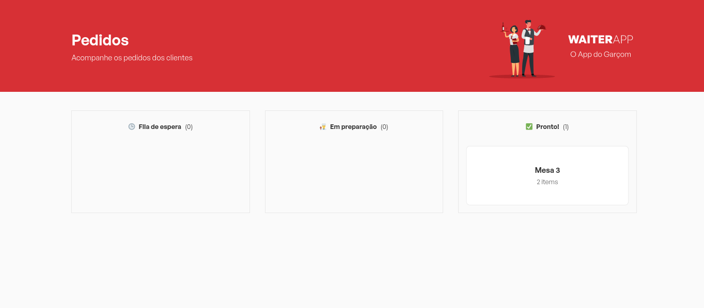
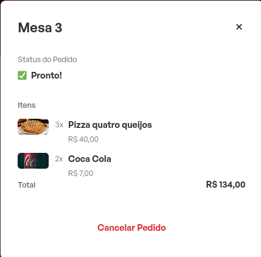

    

# Waiterapp 👩‍🍳️

### O app amigo do garçom.
Projeto desenvolvido durante o evento "O poder do javascript".  
Este app foi criado para substituir as comandas em papel nos restaurantes, facilitando a anotação dos pedidos.

## Screenshots

### dashboard

### Modal

## Demonstração app

    

## Funcionalidades

- Integração em app mobile e Dashboard web
- Dashboard com pedidos em tempo real
- Carrinho de pedidos

## Stack utilizada

**Front-end:** React, React-native, Styled Components

**Back-end:** Node, Express, Mongoose, Mongodb, socket.io

## Autor

- [@guilhermesc-6](https://github.com/guilhermesc-6)

